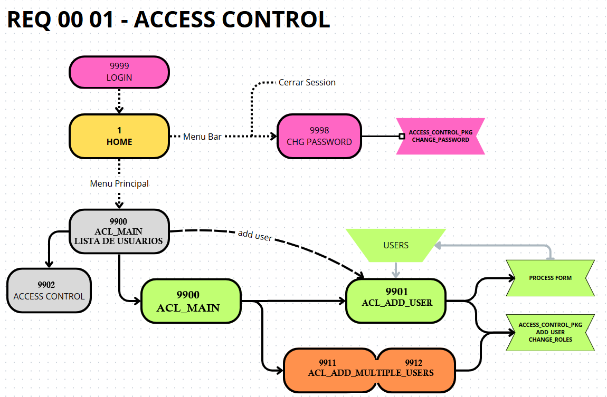

## Page Grups

| Rango | PAGE GROUP        | Req   Detalle
|-------|-------------------|--------------------------------
|   0xx | Main - Menu       |       Pagina Principal  / Pruebas 
|  1xx  | Clientes          | 01 01 Entidades Ventas
|  2xx  | Produccion        | 01 01 Entidades Ventas
|  3xx  | Bobinas           | 01 01 Entidades Ventas
|  4xx  | Compras           | 01 01 Entidades Ventas
|  5xx  | Ventas            | 01 01 Entidades Ventas
|  6xx  | Contaduria        | 01 01 Entidades Ventas
|  2xxx | Produccion        | *02 MODULO Produccion* 
|  21xx | Articulos         | 02 01 Articulos                    | fa-package
|  3xxx | Ventas            | *03 MODULO VENTAS*  
|  30xx | Clientes          | 03 01 Proveedores   
|  31xx | Clientes          | 03 01 Proveedores   
|  32xx | Pedidos           | 03 01 Proveedores   
|  33xx | Entregas          | 03 01 Proveedores   
|  34xx | Facturacion       | 03 01 Proveedores   
|  4xxx | Compras           | *04 MODULO COMPRAS*  
|  40xx | Proveedores       | 04 01 Proveedores   
|  41xx | Cbte Compras      | 04 02 Facturas ND NC de compras 
|  42xx | Pagos a Prov      | 04 01 Facturas ND NC de compras 
|  9xxx | Configuracion     | Administracion Usuarios      | fa-database-wrench
|  91xx | Plan de Cuentas   | 00 01 Administracion Usuarios
|  99xx | Access Control    | 00 01 Administracion Usuarios
| 10xxx | PG                |       Administracion
| 20xxx | USER SETTINGS     |       User Settings 
         
         
## Page Assignment

### Group: 21 Articulos
- 2100	ARTICULOS_MAIN	
- 2101  ARTICULOS_LIST  LISTA DE ARTICULOS
- 2102	ARTICULOS_ABM	ABM ARTICULOS
- 2103	ARTICULOS_IMG	DIALOG AGREGAR IMAGEN 
 
- 2110	ART_TIPO_LIST	LISTA DE TIPOS DE ARTICULOS
- 2111	ART_TIPO_ABM	ABM TIPO DE ARTICULOS

### Group: 22 Valores
- 2210  DOC_CAJAS
- 2220  DOC_CHEQUES
- 2230  DOC_PROPIOS
- 2240  DOC_RETEN

### Group: REQ 01 01 DATOS FISCALES
- 101	datos-fiscales1	DATOS FISCALES
- 102	datos-fiscales	DATOS FISCALES
- 109	buscar-razon-social	BUSCAR RAZON SOCIAL
- 111	dialog-asociar	Dialog_asociar

### Group: REQ 01 02 CLIENTES
- 103	clientes1	CLIENTES
- 104	clientes	CLIENTES
- 105	vendedores1	VENDEDORES
- 106	vendedores	VENDEDORES
- 107	vendedor	VENDEDOR
- 108	cliente-dash	CLIENTE DASH
- 110	direcciones	DIRECCIONES

### Group: 3 - VENTAS
PEDIDOS / presupuestos
ENTREGAS / remitos 
FACTURACION 
COBRANZAS

### Group: 4 - COMPRAS
- 4000  COMPRAS_MAIN
- 4001  PROVEEDORES_LIST 
- 4002  PROVEEDORES_ABM
- 
- 4010  PROVEEDOR_DASH
- 
- 4100  COMPRAS_CBTE_LIST
- 4101  COMPRAS_CBTE_ADD
- 4102  COMPRAS_CBTE_ABM
 
- 4200  COMPRAS_PAGOS_LIST
- 4201  COMPRAS_PAGOS_ADD
- 4202  COMPRAS_PAGOS_ABM

- 4300  COMPRAS2_LIST
- 4301  COMPRAS2_CBTE_ADD
- 4302  COMPRAS2_CBTE_ABM
- 4303  COMPRAS2_PAGOS_ABM

### Group: 90 CONFIGURACION
- 9100 901	PC_MAIN 	Plan de Cuentas
- 9101 902	PC_CUENTAS	ABM Cuentas
- 
- 9110 CBTE_TIPOS_CONFIG    V_CBTE_TIPOS
- 9120 DOCS_TIPOS_CONFIG    V_DOC_TIPOS

### Group: 99 Access Control [99xx] 
- 9900 - ACL_MAIN : Lista de Usuarios
- 9901 - ACL_ADD_USER : Dialog Page Add User
- 9902 - ACL_CONFIG : Dialog configue access control ?? 
- 9911 - ACL_ADD_MULTIPLE_USERS_1 : Wizzard step 1 
- 9912 - ACL_ADD_MULTIPLE_USERS_2 : Wizzard step 2 - confirm
- 9998 - CHDPWD : cambio de password
- 9999 - LOGIN  

### Group: 00 Main [0xx]
> Menu Principal
- 0 - Global Page
- 1 - Home
- 9000 configuracion	Configuracion  
    > Menu Configuracion List

### Group: Administracion [10xxx]
10000	administration	Administration
10010	configuration-options	Configuration Options
10020	application-appearance	Application Appearance
10030	activity-dashboard	Activity Dashboard
10031	top-users	Top Users
10032	application-error-log	Application Error Log
10033	page-performance	Page Performance
10034	page-views	Page Views
10035	automations-log	Automations Log
10036	log-messages	Log Messages
10050	feedback	Feedback
10051	feedback-submitted	Feedback Submitted
10053	manage-feedback	Manage Feedback
10054	feedback1	Feedback
10060	about	About
10061	help	Help

### Group: User Settings [20xxx]
20000	settings	Settings
20010	push-notifications	Push Notifications