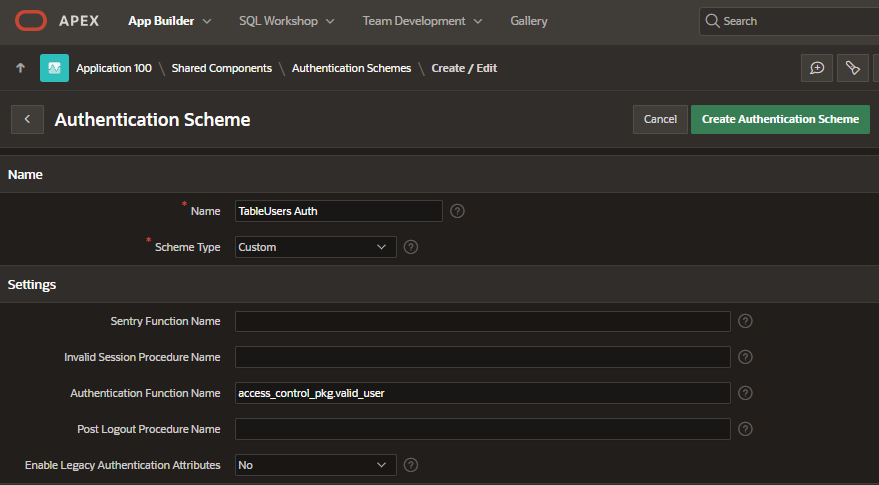

# REQ 00 01 : Control de acceso
ACL - Access Control List 
### SCHEME TYPES 
> Seleccion de tipo de Esquema de Acceso

- LDAP - ACTIVE DIRECTORY -- Es necesario el servidor LDAP. para empresas mas grandes...
- ORACLE APEX ACCOUNTS  -- Facil de usar, pero no puedo delegar el ALTA de los usuarios... 
- ORACLE DATABASE ACCOUNTS -- 
- SOCIAL SIGN-IN
- OPEN DOOR CREDENTIALS
- **CUSTOM** >> CREO MI PROPIO ACL


## Requisitos
1) lista de usuarios
   > datos a incluir: Nombre, apellido, Email
2) alta de usuario
   > solo Username, contraseña generica para primer acceso 
3) edicion de datos
4) elimnar usuario
5) asignacion de roles
6) login
7) cambio de contraseña
   > desde la barra de tareas
8) opcion para de de alta varios usuarios con el mismo rol
   > wizzard para agilizar la carga masiva


## RQ No Funcional      
1) Acceso solo Administrador   
1) Contraseña Encriptada  
1) Administrador no puede auto eliminarse 


## Capa Datos
### T_USERS [>>](t_users.sql)
### T_USER_ROLES [>>](t_user_roles.sql)
### T_USER_APPLYS [>>](t_user_applys.sql)

## Vistas
### USERS [>>](users.view.sql)


## Applicaction Items
   - SESSION_USER_ID
   - SESSION_USERNAME
   

## Funciones
### ACCESS_CONTROL_PKG [>>](access_control_pkg.sql)


## Diagrama de Paginas


## Procedimiento 
1- Crear Aplication Items
   - SESSION_USER_ID
   - SESSION_USERNAME
   > shared Components - Application Items
   > Scope GLOBAL - se replica en todas las aplicaciones

2- Asignar privilegios para usar la funcion para encriptar los password
```sql
connect as sysdba
> GRANT EXECUTE ON dbms_crypto TO #SCHEMA_USER# ;  -- LOA PTC VIC
```

3- Crear Tablas Vistas y Package
```sql
connect as ptc@pdbptc
> @access_control_script.sql
> @access_control_pkg.sql
```

4- Crear Authentication Scheme


5- Crear Usuario Admin
[Crear Roles y Usuario Admin](acl_create_user_admin.sql)


## ToDo
### Evitar que un Admnistrador se autoelimine 

### habilitar login en horario limitado
```sql
function check_business_hours return boolean
is
begin
  return to_number(to_char(sysdate, 'hh24')) between 8 and 17;
end check_business_hours;
```

## referencias
https://www.oneoracledeveloper.com/2021/12/managing-users-roles-and-authorization.html
https://www.lrayner.com/post/creating-a-custom-authentication-schema-apex-18-1
https://oracle-base.com/articles/9i/storing-passwords-in-the-database-9i
 