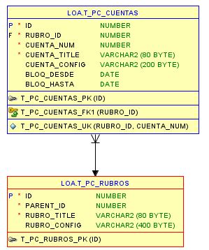

# REQ 00 03 Plan de Cuentas

## Tablas
- t_pc_rubros   (t_cuenta_rubros)
    ID	            NUMBER
    PARENT_ID	    NUMBER
    RUBRO_TITLE	    VARCHAR2(80 BYTE)
    RUBRO_CONFIG	VARCHAR2(400 BYTE)

- t_pc_cuentas  (t_cuentas)
    ID	            NUMBER
    RUBRO_ID	    NUMBER
    CUENTA_NUM	    NUMBER
    CUENTA_TITLE	VARCHAR2(80 BYTE)
    CUENTA_CONFIG	VARCHAR2(200 BYTE)
    BLOQ_DESDE	    DATE
    BLOQ_HASTA	    DATE



  
## Package 


- PLAN_CUENTAS_PKG
  - RAMA_PRINCIPAL
  - CUENTA_TIPOS
  - CUENTA_TITLE
  - CUENTA_TO_STRING
  - AGREGAR_RUBRO
  - GUARDAR_RUBRO
  - AGREGAR_CUENTA
  - SIGUIENTE_RUBRO_ID
  - SIGUIENTE_CUENTA_NUM


## Vistas
- V_PC_RAMA_PRINCIPAL (CUENTA_RAMA_PRINCIPAL)
- V_PC_RUBROS         (CUENTA_RUBROS)
- V_PC_CUENTAS        (CUENTAS - CUENTAS_LOV)
- V_PC_TREE 

 
- CUENTA_TREE
- CUENTA_TIPOS


###  Tipos de Datos
- KEY_TITLE_TYP
- LIST_TREE

### Paginas
- P650 - PLAN DE CUENTAS
- P606 - COMISIONES DE VENTAS
- P605 - TARJETAS
- P604 - EXTRACTO BANCARIO
- P603 - MOVIMIENTOS DE CUENTAS
- P28 - RETENCIONES
- P27 - CHEQUES PROPIOS
- P18 - COMPRAS MENSUAL
- P16 - COMPRAS

### Lovs
- cuenta.title
- cuentas.prov_compras
- cuenta_bancos
- cuenta_in
- cuenta_out
- 
- PLAN_CUENTAS.RUBROS
- PLAN_CUENTAS.RAMA_PRINCIPAL
- PLAN_CUENTAS.CUENTA_TIPOS

## RAMA PRINCIPAL
> Estructura de jeraquia definida en el Package 
### PLAN_CUENTAS_PKG.RAMA_PRINCIPAL
1	ACTIVO
    11	Activo Corriente
    12	Activo NO Corriente
2	PASIVO
    21	Pasivo Corriente
    22	Pasivo NO Corriente
3	PATRIMONIO NETO
    31	Patrimonio Neto
4	GANANCIA
    41	Ingresos Ordinarios
    42	Ingresos Extraordinarios
5	GASTOS
    51	Gastos Ordinarios
    52	Gastos Extraordinarios


## RUBROS


## CUENTAS

## CUENTAS TIPO
        KEY_TITLE_TYP('DEST_CPA', 'CUENTAS DESTINO DE COMPRAS')


## VISTAS

### CUENTA_RAMA_PRINCIPAL
```SQL
CREATE VIEW cuenta_rama_principal AS
    SELECT id
          ,title
          ,parent
      FROM TABLE(plan_cuentas_pkg.rama_principal)cr
     WHERE cr.parent IS NOT NULL
``` 
ID TITLE                          PARENT
-- -------------------------- ----------
11 11 - Activo Corriente               1
12 12 - Activo No  Corriente           1
21 21 - Pasivo Corriente               2
22 22 - Pasivo No  Corriente           2
31 31 - Patrimonio Neto                3
41 41 - Ingresos   Ordinarios          4
42 42 - Ingresos   Extraordinarios     4
51 51 - Gastos Ordinarios              5
52 52 - Gastos Extraordinarios         5


### CUENTA_RUBROS
```sql
CREATE VIEW cuenta_rubros AS
SELECT id
    ,parent 
    ,ID || ' - ' || TITLE TITLE 
FROM T_CUENTA_RUBROS
```
ID  PARENT TITLE
--- ------ ----------
111	   11  111 - Caja
112	   11  112 - Banco
121	   12  121 - Inversiones No Corrientes
122	   12  122 - Bienes de uso
211	   21  211 - Cta cte Proveedores
311	   31  311 - Aportes
312	   31  312 - Reservas
313	   31  313 - Resultados
411	   41  411 - Ingresos por Ventas
521	   52  521 - Honorarios


### CUENTAS
```sql
CREATE VIEW cuentas AS
SELECT id
      ,title
      ,cuenta_rubro_id
      ,cuenta_numero
      ,cuenta_tipo
      ,to_char(cuenta_rubro_id,'000') || to_char(cuenta_numero,'000') Numero
  FROM t_cuentas
```


### CUENTA_TREE 
```SQL
create or replace view cuenta_tree as
SELECT id
       ,title
       ,parent
       ,id cuenta_num
       ,parent parent_id
       ,title  cta_title
       
      FROM TABLE(plan_cuentas_pkg.rama_principal)cr      
 UNION ALL     
 SELECT id
      ,title
      ,parent
      
      ,id cuenta_num
      ,parent parent_id
      ,to_char(id,'990') || ' - ' || TITLE cta_title 
FROM T_CUENTA_RUBROS
```


### CAMBIOS EN VIC

CONSULTA DE P650 --> TREE
```sql
SELECT id
      ,parent_id
      ,cuenta_num
      ,cta_TITLE
      ,level
      ,CASE
    WHEN CONNECT_BY_ISLEAF=1 THEN 0
    WHEN level=1             THEN 1
    ELSE-1
        END                   AS status
      ,CASE
            WHEN level<=3 THEN apex_page.get_url(p_items=>'P650_PARENT_ID',p_values=>"ID")
        END                   link
  FROM CUENTAS_TREE
  WHERE ID < 1000
START WITH
    parent_id=0
CONNECT BY
    PRIOR id=parent_id
 ORDER SIBLINGS BY "CUENTA_NUM";
 ```

view CUENTAS_LOV
```SQL
SELECT id
          ,title    
          ,cuenta_num
          ,parent_id 
          
          ,to_char(parent_id,'000') || to_char(cuenta_num,'000') cta_num
          ,to_char(parent_id,'000') || to_char(cuenta_num,'000') || ' - ' || title  cta_title
          ,to_char(parent_id,'000') || ' - ' || (select title from t_cuentas where id = t1.parent_id) group_by

          ,flg_in    -- lov cuenta_in
          ,flg_out   -- lov cuenta_out
          ,flg_gasto -- lov cuenta_gasto 
          ,flg_banco -- lov cuenta_bancos
          ,flg_prov_compras -- cuentas compras proveedor
          ,INFO -- BANCO_NUM 
      FROM t_cuentas t1
      where id >= 1000
```


```SQL
create or replace FUNCTION S_CUENTA(
    p_id IN NUMBER
   ,p_modo          IN VARCHAR2 DEFAULT 'TITLE'
)RETURN VARCHAR2 AS
    vret VARCHAR2(80);
BEGIN
    SELECT CASE P_MODO
        WHEN 'IDS' THEN TO_CHAR(ID)
        WHEN 'TITLE' THEN TITLE
        WHEN 'CTA_NUM' THEN 
                CASE WHEN ID < 1000 THEN to_char(cuenta_num,'990')
                  ELSE to_char(parent_id,'000') || to_char(cuenta_num,'000') END
        WHEN 'CTA_TITLE' THEN 
                CASE WHEN ID < 1000 THEN to_char(cuenta_num,'990')
                  ELSE to_char(parent_id,'000') || to_char(cuenta_num,'000') END
                  || ' - ' || TITLE 
        WHEN 'FLAG' THEN
            CASE WHEN FLG_GASTO = 1 THEN 'GASTO' END
        WHEN 'PARENT_FLAG' THEN S_CUENTA(PARENT_ID,'FLAG') 
            
      END INTO vret
    FROM T_CUENTAS  
         WHERE id=p_id;

    RETURN vret;
END S_CUENTA;
```